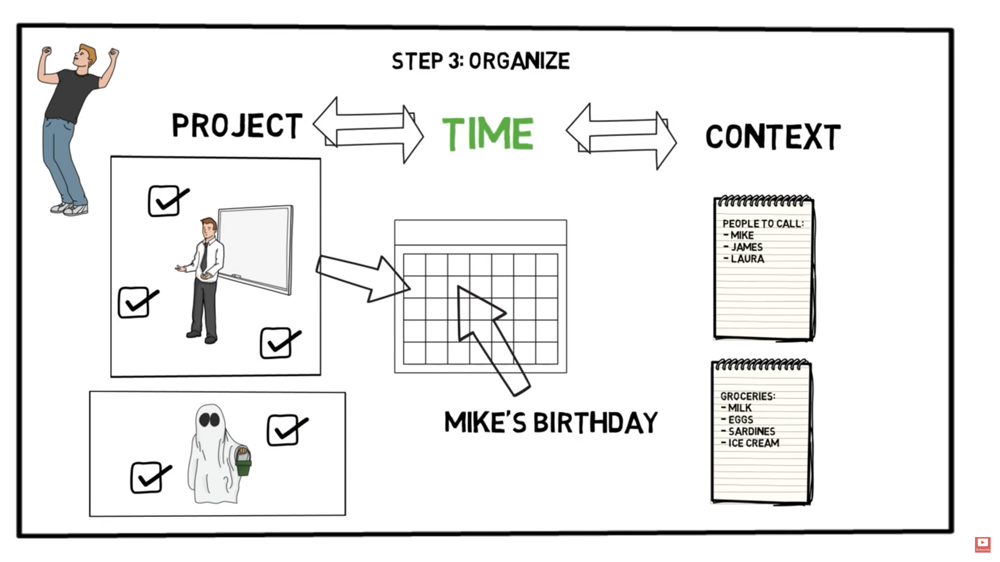

% GTD时间管理
% 汪立民
% 2017/07

# 为什么需要时间管理

-----------------

### Get things Done(GTD) 

* 一种行为管理的方法
* 也是戴维-艾伦写的一本书的书名  
* 通过记录的方式把头脑中的各种任务移出来
* 集中精力在正在完成的事情
* 告诉大脑：“这件事我已经知道，并且做好了规划”

------------------

### 新情况, 新做法

* 目的
    - 所有事务都置入到一个脱离大脑到逻辑系统
    - 训练自己在接受一切输入信息到前期做出决定

* 好处
    - 下一步计划掌握在手
    - 可以实施
    - 可以再议

----------------------

### 新的要求，匮乏的资源

* 信息太多，几乎每件事都可能处理的更加完善
* 工作缺乏明确的边界, 依赖其他部门的配合
* 工作还在不断的变化(产品，用户，市场，技术都在变化）
* 日程表使用
* 没有人敢在接到老板的指令后,不撤消自己事先确定的工作日程

-------------------

### 有效处理内心的承诺

* 如果这件事总占据着你的头脑,你的思维就会受阻
* 任何一件你认为没有完成的事情都应该放到工作篮
* 你必须明白你的工作到底是什么
* 一旦决定了需要采取的行动方案,安排好组织提示信息

--------------------

### 为什么有些事情总是萦绕在你的心头

* 你还没有确切地认定它们的预期结果是什么
* 你还没有决定你下一步的具体行动到底是什么
* 你还没有把即将采取行动的提示信息存入你所依赖的体系中去

-------------------

### 你的大脑并不总那么管用

* 不断地考虑那些毫无进展的事情纯粹是浪费时间和精力
* 控制你的头脑,要么由它来操纵你
* 在大脑中不留任何事情
* 你不能管理重要事宜,你只是拥有它们
* 开始便是行动的一半

# 时间管理的步骤

--------------------

--------------------

### 「收集」

* 百分之百地捕捉
* 清空大脑，尽可能把所有的事情捕捉下来
* 放在集中的收集箱，并且尽可能100%的收集。
* 定期清理
* 收集工具
    - 实实在在的工作篮
    - 纸制的记事簿
    - 电子记事簿
    - 录音设备
    - 电子邮件

---------------------

---------------------

### 「加工处理」

* 这是一件什么事情?
* 是否需要采取行动？
* 不需要采取行动
    - 没用的垃圾
    - 目前没有采取行动的必要
    - 该信息具体潜在的利用价值，将来某时/也许
    - 备忘录文件夹

* 需要采取行动
    - 你已经承诺完成哪些工作？
    - 需要达到什么样的结果？
    - 下一步行动是什么？

---------------------

---------------------

### 「整理」

* 组织下一步行动清单
    - 行动种类
    - 日程表

* 可以随时因时制宜，知道现在可以采取什么行动。
* 行动决策的4个标准
    - 环境
    - 需要多长时间
    - 需要多少资源
    - 重要性

---------------------

---------------------

### 「回顾检视」

* 回顾的内容和时机
* 成功的关键因素:每周查阅
* 检视项目
    - 所有悬而未决的问题
    - 现行工作计划
    - 下一步行动
    - 日程安排
    - 等待处理
    - 将来某时/也许清单

* 检视事项
    - 收集和加工处理所有的**材料**   
    - 回顾和检查你的系统
    - 更新各类清单
    - 做到清洁、清楚、实时和完整

---------------------

---------------------

### 「行动」：

* 再完美好的计划，如果不执行,就等于0
* 你的系统就会值得信赖
* 可以依靠这个系统安心地去执行设定好的任务
* 专注在重要任务上。

---------------------

# 时间管理工具

-----------------------

### 常用工具
* 一般笔记本，纸张，笔
* 专门的GTD笔记本
* 软件工具:
    - OmniFocus
    - Things
    - Google calendar
    - wunderlist

