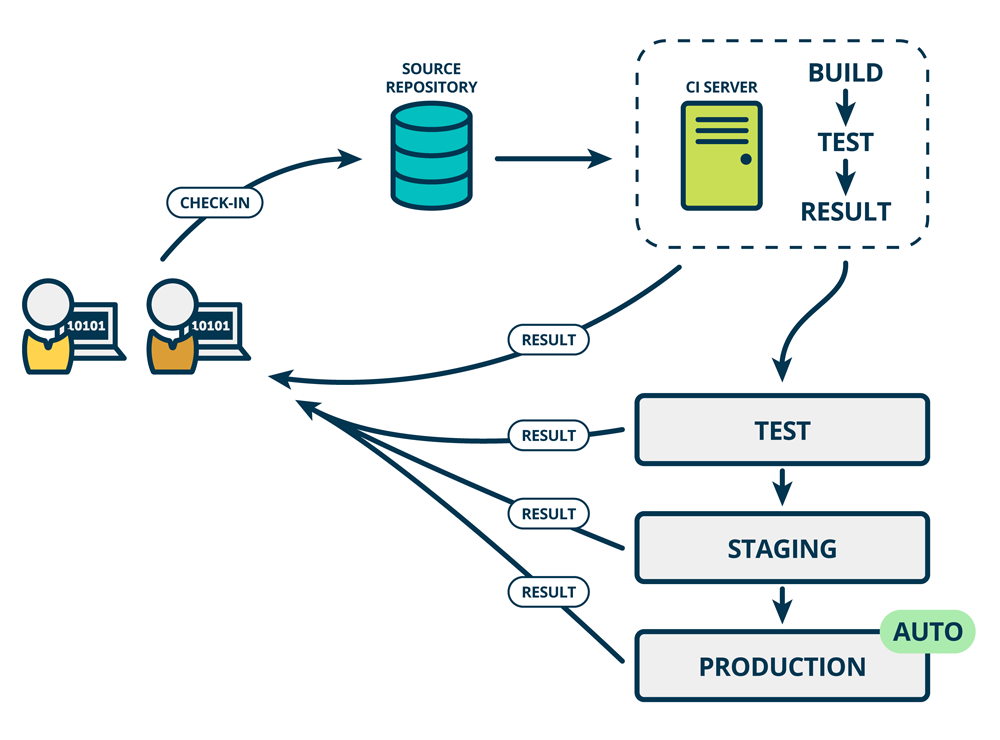

# 持续集成和构建

------

### 持续系统构成

* 一个自动构建过程, 包括自动编译、分发、部署和测试等
* 一个代码存储库，即需要版本控制软件来保障代码的可维护性
* 一个持续集成服务器

------

### 主要优点

* 快速发布。能够应对业务需求，并更快地实现软件价值
* 降低风险, 没有长时间集成
* 频繁迭代周期缩短，获得反馈迅速
* 高质量的软件发布标准。整个交付过程标准化、可重复、可靠
* 整个交付过程进度可视化，方便团队人员了解项目成熟度
* 提高系统稳定性，增强团队的信心

# 持续集成(CI)
### 开发流程

-----

- *Code(编码)* -> *Build(构建)* -> *Integrate(集成)* -> *Test(测试)*
- 持续集成是一种软件开发实践
- 团队开发成员每个人都可以看到进度
- 团队开发成员经常集成他们的工作
- 通过自动化的构建验证，从而尽早地发现集成错误
- 持续集成中最重要的就是沟通

-----

### 功能

- 全面的自动化测试
- 灵活的基础设施
- 版本控制工具：Git, SVN, CVS...
- 自动化的构建和软件发布流程的工具：Jenkins, Buildbot, Travis CI...
- 反馈机制：如构建/测试的失败，可以快速反馈

-------

# 持续交付

* 频繁地将软件的新版本，交付给质量团队或者用户，以供评审
* 如果评审通过，代码就进入生产阶段 

------

### 工作流程

- *编码* -> *构建* -> *集成* -> *测试* -> *交付*
- 持续交付可以看作持续集成的下一步
- 强调不管怎么更新，软件是随时随地可以交付的  

------

# 持续部署

### 工作流程

* *编码* -> *构建* -> *集成*-> *测试* -> *交付* -> *部署*
* 指的是代码通过评审以后，自动部署到生产环境 
* 目标代码在任何时刻都是可部署的，可以进入生产阶段  
* 能自动化完成测试、构建、部署等步骤
* 它与持续交付的区别，可以参考下图  

--------

# 流程说明 

-------

### 提交  
* 流程的第一步，是开发者向代码仓库提交代码
* 每人每天都要向 mainline 提交代码, 减少冲突
* 原则是谁提交，谁负责
* 所有后面的步骤都始于本地代码的一次提交(commit)  

-------

### 测试（第一轮）  

* 代码仓库对commit操作配置了钩子（hook）
* 只要提交代码或者合并进主干，就会跑自动化测试
* 第一轮至少要跑单元测试 

-------

### 测试分类

* 单元测试：针对函数或模块的测试  
* 集成测试：针对整体产品的某个功能的测试，又称功能测试  
* 端对端测试：从用户界面直达数据库的全链路测试  

------

### 构建  

* 通过第一轮测试，代码就可以合并进主干，就算可以交付了  
* 交付后，就先进行构建（build），再进入第二轮测试
* 所谓构建，指的是将源码转换为运行二进制，比如安装依赖, 配置各种资源等等  
* 工具 
    - [Jenkins](http://jenkins-ci.org/)   
    - [Travis](https://travis-ci.com/)  

------

### 测试（第二轮）  

* 构建完成，就要进行第二轮测试
* 第二轮是全面测试，单元测试和集成测试都会跑
* 新版本的每一个更新点都必须测试到
* 最好有模拟生产环境可以测试
* 如果测试的覆盖率不高，后期部署阶段后，很可能会出现严重的问题

------

### 部署

* 通过了第二轮测试，当前代码就是一个可以直接部署的版本
* 将这个版本的所有文件打包存档，发到生产服务器 
* 生产服务器将打包文件，解包成本地的一个目录，更新号链接

-----

### 回滚  

* 一旦当前版本发生问题，就要回滚
* 简单的做法就是修改一下符号链接，指向上一个版本的目录 

------

### 参考链接

* [Continuous Integration](https://www.martinfowler.com/articles/continuousIntegration.html) 
* [The Product Managers's Guide to Continuous Delivery and DevOps](http://www.mindtheproduct.com/2016/02/what-the-hell-are-ci-cd-and-devops-a-cheatsheet-for-the-rest-of-us/)
* [基于Jenkins 快速搭建持续集成环境](https://www.ibm.com/developerworks/cn/java/j-lo-jenkins/)

# 结束， 谢谢
